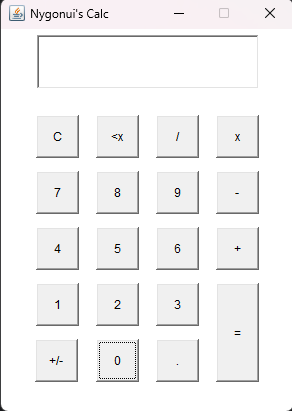

# MyJavaCalculator
## Description
The project is a simple calculator writing in Java. With all the basic math operations and some
others functionalities, like change the number's positivity, delete all and delete last character.

I create this project just because I'm learning Java and wanted to create something by my own,
to put in practice what I learned. I searched for "Java projects ideas" in google and 
found this page: [14 Java Projects For All Levels: Beginner, Intermediate, & Advanced](https://www.datacamp.com/blog/java-projects-for-all-levels).
So I started with the first and here we are.



## My Dev Environment 
In the present moment if I run `java --version` in my terminal the result it is as follows:
```shell
java 22.0.2 2024-07-16
Java(TM) SE Runtime Environment (build 22.0.2+9-70)
Java HotSpot(TM) 64-Bit Server VM (build 22.0.2+9-70, mixed mode, sharing)
```
## What I Used:
- Java AWT API
  - (Abstract Window Toolkit) was the API that I use to build the calculator UI.
  - Doc: [Java AWT Tutorial](https://www.javatpoint.com/java-awt)
  - For no particularly reason I chose Java AWT, I just used it because was the first that I found when I was looking for.

## To-do
For now, I will start a new project (maybe the 2nd from the list), although here are some things 
that I want to improve when I go back to myJavaCalculator project:
- Improve the visual, make more pretty.
- Implement the capability to resolve math operations with more than two values.
- Make the interface responsible.
- Implement the use of keyboard to do the math operations

## Contribution
As this project is a study project I won't merge pull request with code, but I will accept suggestions,
bugs reports, critics, etc.

## Running the project
- Install Java
- Clone the repository 
- Run `Main.java`
